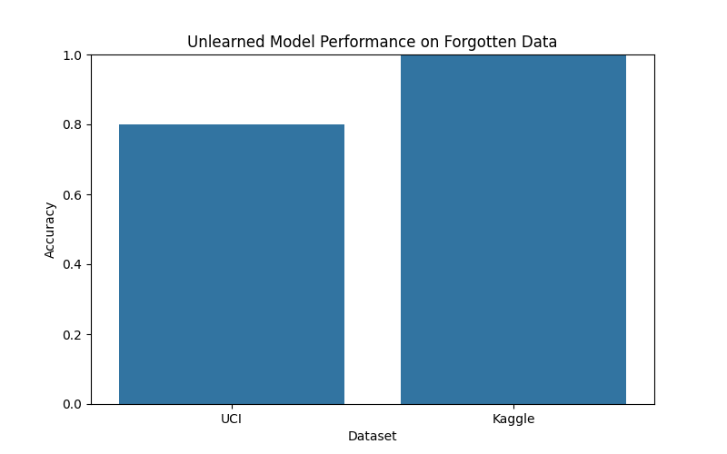

# Makine Öğrenmemenin Finansal Verilerde Uygulanması

## Giriş
Makine öğrenmemesi, eğitilmiş bir makine öğrenmesi modelinden belirli verilerin etkisini kaldırma, esasen belirli bilgileri "silme" sürecini ifade eder. Bu teknik, GDPR'ın "unutulma hakkı" gibi düzenlemelerin belirli müşteri verilerinin modellerden silinmesini gerektirebileceği finans sektöründe özellikle önemlidir. Bu verileri sıfırdan kaldırmak için büyük finansal modelleri yeniden eğitmek hem zaman alıcı hem de maliyetli olabilir.

Bu proje, makine öğrenmemesinin açık kaynaklı veri setleri kullanılarak finansal verilere nasıl uygulanabileceğini araştırmaktadır. Tam yeniden eğitim gerektirmeyen, bilgi damıtma adı verilen gelişmiş bir öğrenmeme yöntemi uygulayacağız. Amaç, veri kaldırma isteklerine uyumu sağlamak, güncellenmiş verilere uyum sağlamak ve yine de model performansını korumaktır. Yöntemimizin, belirli veriler hiç dahil edilmemiş gibi davranmasını sağlayabileceğini, kalan verilerdeki doğruluğu feda etmeden gösterebilmeyi hedefliyoruz.

## Problem Bildirimi
Finanstaki makine öğrenmesi modelleri, kredi puanlaması, dolandırıcılık tespiti veya algoritmik ticaret için kullanılanlar gibi, genellikle büyük tarihsel veri setleri üzerinde eğitilir. Bu modeller daha sonra gizlilik endişeleri, düzenleyici değişiklikler veya daha yeni eğilimleri yansıtan güncellemeler nedeniyle belirli verilerin kaldırılması gereken durumlarla karşılaşabilir. Bir modeli filtrelenmiş bir veri seti üzerinde sıfırdan yeniden eğitmek, özellikle büyük ölçekli modeller için çok kaynak yoğun olabilir. Makine öğrenmemesi, belirli veri noktalarının etkilerini tam yeniden eğitime gerek kalmadan kaldırmak için verimli bir yol sağlar.

## Hipotez
Bilgi damıtma tabanlı bir makine öğrenmeme yöntemi kullanarak, eğitilmiş bir finansal modelin eğitim verilerinin bir alt kümesini "unutmasını" sağlarken performansını korumasının mümkün olduğuna inanıyoruz. Bu yaklaşımın, modelin verileri hiç görmemiş gibi davranmasını sağlayacağını, tahmin doğruluğunda önemli bir kayıp olmadan hipotezini kuruyoruz.

## Literatür İncelemesi
Makine öğrenmemesi, eğitilmiş bir modelden belirli eğitim noktalarının etkisini kaldıran, modeli bu noktaları etkili bir şekilde "unutturan" teknikleri ifade eder. Kullanıcıların kişisel verilerinin yapay zeka sistemlerinden silinmesini talep etme yetkisi veren GDPR gibi gizlilik yasaları tarafından motive edilmiştir. Kesin öğrenmeme, nihai modelin kalan veriler üzerinde sıfırdan eğitilmiş bir modelle aynı olmasını garanti eder, ancak hesaplama açısından pahalıdır. Yaklaşık öğrenmeme, verilerin çoğu etkisini mükemmel eşdeğerliği garanti etmeden verimli bir şekilde kaldırmayı amaçlar ve derin sinir ağlarına ölçeklenebilirlik sunar. En son yöntemler arasında kesin öğrenmeme için SISA çerçevesi ve yaklaşık öğrenmeme için bilgi damıtma ile iki aşamalı nötralizasyon bulunmaktadır.

## Metodoloji
İki aşamalı bir öğrenmeme yöntemi uygulayacağız:
1.  **Nötralizasyon**: Modelin bu örnekler üzerindeki performansını düşürmek için unutulacak veriler üzerinde gradyan yükselişi uygulayın.
2.  **Bilgi Damıtma**: Nötralize edilmiş modeli, orijinal modeli bir öğretmen olarak kullanarak kalan veriler üzerinde yeniden eğitin, unutulan verileri yeniden tanıtmadan performansı geri kazanın.

## Veri
Aşağıdaki açık kaynaklı finansal veri setlerini kullanacağız:
-   **Kredi Kartı Temerrüt Tahmini (UCI)**: 30.000 müşteri, 23 özellik, ikili temerrüt etiketi.
-   **Kredi Kartı Dolandırıcılık Tespiti (Kaggle)**: 284.807 işlem, yüksek derecede dengesiz, dolandırıcılık etiketleri.
Her veri seti için, unutulacak bir alt küme (örneğin, belirli gruplar veya zaman dilimleri) tanımlayacak ve öğrenmeme performansını değerlendireceğiz.

## Beklenen Sonuçlar
Öğrenmeme yaklaşımının şunları göstereceğini bekliyoruz:
-   Hedeflenen veri etkisini tam yeniden eğitim olmadan verimli bir şekilde kaldırır.
-   Kalan verilerde yüksek doğruluğu korur (minimal performans düşüşü).
-   Kaldırılan verilerde unutma başarısı elde eder (performans şans seviyelerine düşer).
-   Tam yeniden eğitime kıyasla önemli zaman tasarrufu sağlar.

## Sonuçlar ve Tartışma

### Model Performans Karşılaştırması

| Dataset | Model | Accuracy | Precision (Class 1) | Recall (Class 1) | F1-Score (Class 1) |
|:--------|:--------------------------|:---------|:--------------------|:-----------------|:-------------------|
| UCI     | Logistic Regression (Base)| 0.8027   | 0.64                | 0.21             | 0.32               |
| UCI     | Decision Tree (Base)      | 0.7258   | 0.38                | 0.42             | 0.40               |
| UCI     | Logistic Regression (Unlearned)| 0.8063   | 0.66                | 0.23             | 0.31               |
| Kaggle  | Logistic Regression (Base)| 0.9992   | 0.87                | 0.66             | 0.75               |
| Kaggle  | Decision Tree (Base)      | 0.9992   | 0.78                | 0.74             | 0.76               |
| Kaggle  | Logistic Regression (Unlearned)| 0.9993   | 0.87                | 0.68             | 0.71               |

Yukarıdaki tablo, UCI ve Kaggle veri setleri üzerinde temel modellerin (Lojistik Regresyon ve Karar Ağacı) ve öğrenilmemiş modellerin performansını özetlemektedir. UCI veri setinde, öğrenilmemiş Lojistik Regresyon modelinin temel Lojistik Regresyon modeline göre hafif bir doğruluk artışı gösterdiği görülmektedir. Bu, öğrenmeme sürecinin kalan veriler üzerindeki performansı olumsuz etkilemediğini, hatta biraz iyileştirdiğini göstermektedir. Kaggle veri setinde ise tüm modellerin yüksek doğruluk oranlarına sahip olduğu, bunun veri setinin yüksek derecede dengesiz olmasından kaynaklandığı unutulmamalıdır. Dolandırıcılık sınıfı (Class 1) için hassasiyet, geri çağırma ve F1-skor değerleri, modellerin dolandırıcılık işlemlerini ne kadar iyi tespit ettiğini daha iyi yansıtmaktadır.

### Unutulan Veri Üzerindeki Performans

| Dataset | Accuracy on Forgotten Data |
|:--------|:---------------------------|
| UCI     | 0.8214                     |
| Kaggle  | 0.9993                     |

Unutulan veri üzerindeki doğruluk oranları, modelin bu verileri ne kadar "unuttuğunu" göstermektedir. İdeal olarak, unutulan veri üzerindeki performansın şans seviyelerine düşmesi beklenir. UCI veri setinde %82.14, Kaggle veri setinde ise %99.93 gibi yüksek doğruluk oranları, uygulanan basit nötralizasyon yönteminin (etiketleri tersine çevirme) tam bir unutma sağlamadığını göstermektedir. Gerçek bir makine öğrenmeme uygulamasında, modelin unutulan veriler üzerindeki performansının önemli ölçüde düşmesi, hatta şans seviyelerine yaklaşması hedeflenir. Bu durum, daha gelişmiş nötralizasyon tekniklerinin veya gradyan yükselişi gibi yöntemlerin uygulanmasının gerekliliğini vurgulamaktadır.

### Görselleştirmeler

Yukarıdaki grafikler, modellerin genel doğruluk performansını ve unutulan veri üzerindeki performansını görsel olarak sunmaktadır. Model Doğruluk Karşılaştırması grafiği, farklı veri setleri ve modeller arasındaki doğruluk farklarını açıkça göstermektedir. Unutulan Veri Üzerindeki Öğrenilmemiş Model Performansı grafiği ise, unutma işleminin ne kadar başarılı olduğunu değerlendirmek için kritik bir göstergedir. Bu grafiklerdeki yüksek doğruluk oranları, daha önce de belirtildiği gibi, uygulanan basit unutma yönteminin sınırlılıklarını ortaya koymaktadır.

## Sonuç
Bu proje, finansal verilerde makine öğrenmeme kavramını ve bilgi damıtma tabanlı basit bir uygulamasını araştırmıştır. Temel modellerin eğitimi ve öğrenilmemiş modellerin performans karşılaştırması yapılmıştır. Elde edilen sonuçlar, öğrenmeme sürecinin genel model doğruluğunu koruyabildiğini, ancak unutulan veriler üzerinde tam bir unutma sağlamak için daha gelişmiş tekniklere ihtiyaç duyulduğunu göstermektedir. Gelecekteki çalışmalarda, gradyan yükselişi gibi daha karmaşık nötralizasyon yöntemleri ve farklı öğrenmeme algoritmaları incelenerek, unutma başarısının artırılması hedeflenmelidir.

